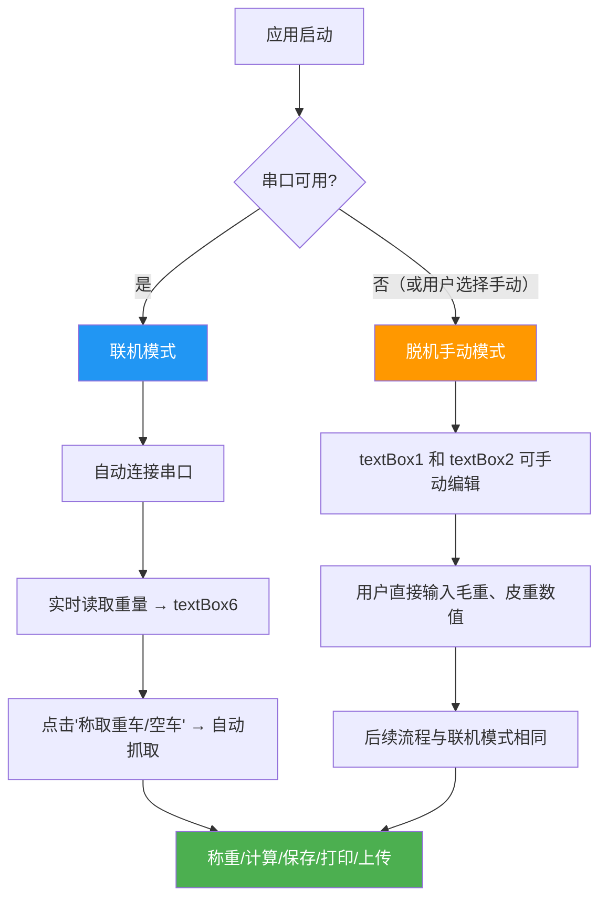

# 一期项目功能完成度评估

---

**评估日期**：2026-07-04  
**评估范围**：psim-weigh 项目 master 分支  
**评估方法**：逐项遍历源码，匹配实际代码实现  

---

## 评估总览

| 状态 | 数量 | 占比 |
|------|------|------|
| ✅ 已完成 | 6 | 33.3% |
| 🔶 部分完成 | 4 | 22.2% |
| ❌ 未完成 | 8 | 44.4% |
| **合计** | **18** | **100%** |

```
完成度: ███████░░░░░░░░░░░░░ 33.3%

✅ 已完成 (6):  登录  串口配置  自动读取重量  手动称重  毛重  皮重  净重
🔶 部分完成 (4): 车牌维护  重量日志  串口日志  打印
❌ 未完成 (8):  参数设置  自动连接串口  稳定判断  查询  导出  重量修改  脱机独立使用
```

---

## 逐项评估

### 1、登录

> **状态**：✅ 已完成

**实现文件**：`UserLogin.cs`、`UserLogin.Designer.cs`、`user.cs`、`UserInfo.cs`、`HTTPS.cs`

**已实现**：

| 功能点 | 代码位置 | 说明 |
|--------|----------|------|
| 登录窗口 UI | `UserLogin.Designer.cs:29-112` | 用户名 + 密码输入框 + 登录/取消按钮 |
| 表单校验 | `UserLogin.cs:18-21` | 账户或密码为空时 MessageBox 提示 |
| HTTP 认证请求 | `UserLogin.cs:28-29` | POST 到 `localhost:9999/ums/login`，表单编码 |
| JSON 响应解析 | `UserLogin.cs:33` | Newtonsoft.Json 反序列化为 `UserInfo` 对象 |
| 会话状态保持 | `UserLogin.cs:34-39` | 将 userId/userName/token/roleId/roleName 写入 `user.cs` 静态字段 |
| 登录入口触发 | `Form1.cs:427-431` | 点击"打印"按钮时检测 `user.token`，为空则弹出登录窗口 |

**缺失**：

| 缺失项 | 说明 |
|--------|------|
| 登录失败提示 | `HttppPost` 返回空字符串时直接跳过，用户不知道登录失败 |
| Token 过期处理 | 无过期检测和刷新机制 |
| 注销功能 | 无退出登录功能 |

---

### 2、参数设置

> **状态**：❌ 未完成

**证据**：

- `app.config` 仅声明运行时版本，无任何自定义配置节
- `Properties/Settings.settings` 为空文件，无任何 settings 项
- `Properties/Settings.Designer.cs` 仅有空壳类

**全部硬编码的参数**：

| 参数 | 硬编码位置 | 当前值 |
|------|-----------|--------|
| 服务器登录地址 | `UserLogin.cs:17` | `http://localhost:9999/ums/login` |
| 服务器上传地址 | `Form1.cs:455` | `http://10.102.84.200:9999/pms/weightinfo/addWeightinfo` |
| 旧版登录地址 | `UserControl1.cs:22` | `https://psim.sunhaijie.top:9999/ums/login` |
| 默认波特率 | `Form1.cs:28` | 600 |
| 默认数据位 | `Form1.cs:29` | 8 |
| 默认校验位 | `Form1.cs:30` | None |
| 默认停止位 | `Form1.cs:31` | 1 |
| 数据库路径 | `DatabaseHelper.cs:16` | `{BaseDirectory}/Data/weigh.db` |

**缺失**：

| 缺失项 | 说明 |
|--------|------|
| 参数设置界面 | 无可视化配置窗口 |
| 配置持久化 | 串口参数、打印机、服务器地址不会保存，重启后恢复默认 |
| 配置导入/导出 | 不支持 |

---

### 3、串口配置

> **状态**：✅ 已完成

**实现文件**：`Form1.cs:86-165`（button1_Click）、`Form1.Designer.cs:91-220`（panel1 UI）

**已实现**：

| 功能点 | UI 控件 | 代码位置 |
|--------|---------|----------|
| 串口号选择 | comboBox1（动态扫描可用串口） | `Form1.cs:33` |
| 波特率选择 | comboBox2（600/1200/2400/4800/9600） | `Form1.Designer.cs:212-218` |
| 数据位选择 | comboBox3（8） | `Form1.Designer.cs:170-174` |
| 校验位选择 | comboBox4（None/Odd/Even/Mark/Space） | `Form1.Designer.cs:160-164` |
| 停止位选择 | comboBox5（1/0） | `Form1.Designer.cs:150-154` |
| 参数应用 | button1 打开串口时读取下拉框值设置 SerialPort | `Form1.cs:117-136` |
| 状态指示 | label6（红色"串口已关闭" / 绿色"串口已打开"） | `Form1.cs:104-105, 142-143` |

**缺陷**：

| 缺陷 | 严重程度 | 说明 |
|------|----------|------|
| 停止位 "0" 非法选项 | 🔴 高 | comboBox5.Items 包含 "0"，`StopBits.None` 不是有效的串口停止位参数，会导致异常 |

---

### 4、自动连接串口

> **状态**：❌ 未完成

**证据**：

- `Form1_Load` 仅设置默认参数值，不执行 `serialPort1.Open()`
- 无任何 `Form1_Load` 或 `Form1` 构造函数中调用 `serialPort1.Open()` 的代码
- 无定时重连、启动自动连接等相关逻辑
- 必须由用户手动点击"打开串口"按钮才连接

**缺失**：

| 缺失项 | 说明 |
|--------|------|
| 启动自动连接 | 应用启动后不会自动打开上次使用的串口 |
| 配置记忆 | 没有保存上次使用的串口号和参数 |
| 断线重连 | 串口断开后不会自动重新连接 |

---

### 5、自动读取重量

> **状态**：✅ 已完成

**实现文件**：`Form1.cs:195-261`（serialPort1_DataReceived）

**已实现**：

| 功能点 | 代码位置 | 说明 |
|--------|----------|------|
| 数据接收事件 | `Form1.cs:195` | 订阅 `serialPort1.DataReceived` 事件，后台线程自动触发 |
| 协议解析（等号格式） | `Form1.cs:243-244` | 提取 `=` 后面的数字，去前导零 |
| 协议解析（STX/ETX 帧） | `Form1.cs:222-238` | 检测 `0x02` 帧头，读取直到 `0x03` 帧尾 |
| UI 线程调度 | `Form1.cs:210` | `this.Invoke()` 安全更新 UI |
| 实时重量显示 | `Form1.Designer.cs:258-265` | textBox6 36pt 大字体实时显示 |
| 原始数据日志 | `Form1.cs:247` | textBox_receive 追加显示原始数据 |
| 字节计数 | `Form1.cs:202,248` | 累计接收字节数，显示在状态栏 |

---

### 6、稳定判断

> **状态**：❌ 未完成（代码已写，但未集成）

**证据**：

`ScaleService.cs` 实现了完整的稳定重量检测算法（第 254-281 行）：

```csharp
public async Task<decimal> GetStableWeightAsync(int timeoutSeconds = 10, 
    decimal stabilityThreshold = 0.01m)
```

**算法逻辑**：每 200ms 采样一次，连续 5 次变化 < 0.01 吨即判定为稳定。

**但是**：

- `ScaleService` 类**从未被 Form1.cs 引用或实例化**
- Form1 的串口处理是内联的 `serialPort1_DataReceived` 事件，直接显示原始重量
- 用户在界面上看到的重量是实时跳动的，需要人工判断是否稳定
- 无任何稳定性指示器（如绿色指示灯、稳定提示文字等）

**缺失**：

| 缺失项 | 说明 |
|--------|------|
| 集成 ScaleService | 需将 Form1 的串口处理迁移到使用 ScaleService |
| 稳定指示器 UI | 需要显示"重量不稳定/已稳定"状态标识 |
| 自动锁定重量 | 稳定后自动锁定重量值供操作员确认 |

---

### 7、手动称重

> **状态**：✅ 已完成

**实现文件**：`Form1.cs:168-193`（button2_Click — 称取重车）、`Form1.cs:294-314`（button4_Click — 称取空车）

**已实现**：

| 功能点 | UI 按钮 | 代码位置 | 说明 |
|--------|---------|----------|------|
| 称取重车 | button2（"称取重车"） | `Form1.cs:168` | 将实时重量 textBox6 → 毛重 textBox1 |
| 称取空车 | button4（"称取空车"） | `Form1.cs:294` | 将实时重量 textBox6 → 皮重 textBox2 |
| 车牌校验 | 两个按钮 | `Form1.cs:170-177, 297-302` | 车牌为空时蜂鸣 + MessageBox |
| 重量校验 | 两个按钮 | `Form1.cs:179-184, 304-309` | 称重为空时蜂鸣 + MessageBox |

---

### 8、毛重

> **状态**：✅ 已完成

**UI 控件**：`textBox1`（Form1.Designer.cs:431-438），标签"重车"  
**数据来源**：点击"称取重车"按钮，从 `textBox6`（实时重量）复制  
**用途**：参与净重计算，上传到服务器时作为 `roughWeight` 字段

---

### 9、皮重

> **状态**：✅ 已完成

**UI 控件**：`textBox2`（Form1.Designer.cs:421-428），标签"空车"  
**数据来源**：点击"称取空车"按钮，从 `textBox6`（实时重量）复制  
**用途**：参与净重计算，上传到服务器时作为 `tare` 字段

---

### 10、净重

> **状态**：✅ 已完成

**实现文件**：`Form1.cs:386-415`（button5_Click — 计算按钮）

**已实现**：

| 功能点 | 代码位置 | 说明 |
|--------|----------|------|
| 自动计算 | `Form1.cs:412-413` | `netWeight = textBox1 - textBox2` |
| 结果显示 | `Form1.Designer.cs:376-381` | textBox3（只读），标签"净重" |
| 前置校验 | `Form1.cs:389-403` | 车牌为空、重量为空时提示 |

**缺陷**：

| 缺陷 | 严重程度 | 代码位置 | 说明 |
|------|----------|----------|------|
| 毛重<皮重未阻止 | 🟡 中 | `Form1.cs:408-411` | 当毛重小于皮重时，进入空 if 块，不做任何处理，净重计算结果为负数 |

---

### 11、车牌维护

> **状态**：🔶 部分完成

**已实现**：

| 功能点 | 代码位置 | 说明 |
|--------|----------|------|
| 省份选择 | `Form1.Designer.cs:412-418` | comboBox7 下拉框，34 个省份简称 + 港澳台 |
| 号码输入 | `Form1.Designer.cs:354-360` | textBox5（CharacterCasing=Upper 自动转大写） |
| 非空校验 | `Form1.cs:170-177` 等多处 | 操作前校验车牌不为空 |

**缺失**：

| 缺失项 | 说明 |
|--------|------|
| 车辆信息库 | 无 Vehicle 表，无法记录车辆类型、标准皮重、所属单位 |
| 车牌自动补全 | 输入历史车牌时无联想提示 |
| 历史车牌列表 | 无下拉选择曾用过的车牌 |
| 车牌格式校验 | 不校验长度和字符合法性（如"AAAAAA"也能通过） |
| 车辆黑名单 | 无黑名单管理和拦截提示 |
| RFID/IC 卡关联 | 无硬件自动识别 |

---

### 12、查询

> **状态**：❌ 未完成

**证据**：

- `DatabaseHelper.cs` 已实现 5 种查询方法：
  - `GetAllWeighRecords()` — 全部记录
  - `GetWeighRecordsByPlate(string)` — 按车牌模糊查询
  - `GetWeighRecordsByDateRange(DateTime, DateTime)` — 按时间范围查询
  - `GetWeighRecordsByCategory(RecordCategory)` — 按记录类别查询
  - `GetPendingReviewRecords()` — 待审核记录
- 但 **Form1.cs 中没有任何地方调用这些方法**
- 项目中不存在 DataGridView、ListView 或任何记录展示控件
- 无搜索框、日期选择器、筛选下拉框等查询 UI

**缺失**：

| 缺失项 | 说明 |
|--------|------|
| 查询界面 | 无专门的历史记录查询窗口 |
| 条件筛选 | 日期范围、车牌、货物类型、业务类型等组合筛选 |
| 结果展示 | DataGridView 表格展示查询结果 |
| 详情查看 | 双击记录查看完整称重详情 |
| 分页 | 大量数据时的分页加载 |

---

### 13、导出

> **状态**：❌ 未完成

**证据**：

- 全项目搜索 `Export`、`导出`、`Excel`、`CSV`、`SaveFileDialog`、`NPOI` 返回 **0 结果**
- 无任何文件导出相关代码或引用

**缺失**：

| 缺失项 | 说明 |
|--------|------|
| Excel 导出 | 无 NPOI/EPPlus 等库，无导出逻辑 |
| CSV 导出 | 无 CSV 文本格式导出 |
| PDF 导出 | 无 PDF 磅单导出 |
| 导出 UI | 无导出按钮和格式选择 |

---

### 14、打印

> **状态**：🔶 部分完成

**已实现（PrintService.cs — 完整但孤立）**：

| 功能点 | 代码位置 | 说明 |
|--------|----------|------|
| 打印服务类 | `PrintService.cs:12-216` | 完整的 PrintService 实现 |
| 打印模板系统 | `PrintService.cs:221-282` | 3 种模板：Standard/A4/Receipt80 |
| 页面绘制 | `PrintService.cs:95-161` | GDI+ 绘制标题、表格、签名区 |
| 打印预览 | `PrintService.cs:77-90` | PrintPreviewDialog |
| 打印设置 | `PrintService.cs:200-215` | PrintDialog |
| 打印机枚举 | `PrintService.cs:46-51` | 获取已安装打印机列表 |

**未完成**：

| 缺失项 | 说明 |
|--------|------|
| **⭐ 最大问题：未集成** | PrintService 类**从未被任何代码调用** |
| 打印按钮功能错误 | Form1 的 button7（"打印"按钮）实际执行的是**数据上传**，不是打印 |
| 打印设置窗口空壳 | print.cs 窗体是空白的，无任何控件 |
| 打印计数未递增 | PrintCount 字段虽然存在，但从未被更新 |
| 小票模板未调试 | Receipt80 模板从未在真实热敏打印机上测试 |

---

### 15、重量修改

> **状态**：❌ 未完成

**证据**：

数据层已完整实现修改记录和审核机制：

| 已实现（数据层） | 代码位置 | 说明 |
|-----------------|----------|------|
| 修改历史存储 | `WeighRecords.ModifyHistory` | JSON 字段，存储修改记录数组 |
| 修改历史模型 | `ModifyHistory.cs:12-284` | ModifyHistoryItem + WeighRecordModifyHistory |
| 临时修改标记 | `DatabaseHelper.cs:475` | `MarkAsTemporary()` |
| 废弃标记 | `DatabaseHelper.cs:498` | `MarkAsInvalid()` |
| 审核机制 | `DatabaseHelper.cs:433` | `ReviewWeighRecord()` |

**缺失**：

| 缺失项 | 说明 |
|--------|------|
| **⭐ 最大问题：无 UI** | 所有修改功能仅存在于数据层，完全没有操作界面 |
| 称重记录编辑窗口 | 无记录详情窗口，无法修改任意字段 |
| 修改原因录入 | 无输入修改原因的界面 |
| 修改历史查看 | 无查看历史修改记录的窗口 |
| 审核界面 | 无待审核列表和审核操作 UI |
| 修改权限控制 | 无基于角色的修改权限 |

---

### 16、重量日志

> **状态**：🔶 部分完成

**已实现**：

| 功能点 | 代码位置 | 说明 |
|--------|----------|------|
| 实时重量显示 | `Form1.Designer.cs:258-265` | textBox6 36pt 大字号 |
| 原始数据日志 | `Form1.Designer.cs:288-294` | textBox_receive 追加 ASCII/HEX 数据 |
| 日志清空 | `Form1.cs:279-284` | button3 清空接收区 |

**缺失**：

| 缺失项 | 说明 |
|--------|------|
| 重量日志持久化 | textBox_receive 是内存中的 UI 控件，关闭应用即丢失 |
| 结构化重量记录 | 无时间戳 + 重量值的结构化日志 |
| 日志文件存储 | 无文件日志（.txt 或 .log），button9 "日志保存" 按钮无事件处理 |
| 重量变化曲线 | 无趋势图/变化曲线 |
| 日志检索 | 无法按时间搜索历史重量数据 |
| 异常重量告警 | 无重量突变/超限告警机制 |

---

### 17、串口日志

> **状态**：🔶 部分完成

**已实现**：

| 功能点 | 代码位置 | 说明 |
|--------|----------|------|
| 原始数据日志 | `Form1.Designer.cs:288-294` | textBox_receive 显示 HEX/ASCII 原始字节 |
| 字节计数 | `Form1.cs:202,248` | label7 显示 Rx 字节总数 |
| 日志清空 | `Form1.cs:279-284` | button3 清空接收区 |
| 数据模式切换 | `Form1.Designer.cs:524-535` | ASCII / HEX 单选按钮 |

**缺失**：

| 缺失项 | 说明 |
|--------|------|
| 串口日志持久化 | 同重量日志，无文件存储 |
| 日志保存按钮 | button9 "日志保存" 无事件处理代码 |
| 时间戳标记 | 原始数据无接收时间标记 |
| 通信错误日志 | 串口异常（帧错误、校验错误、超时）未单独记录 |
| 日志文件管理 | 无日志文件大小限制、滚动策略、自动清理 |

---

### 18、脱机独立使用（不连接串口）

> **状态**：❌ 未完成  
> **需求依据**：`Claude开发规范.txt` 第 10 条 —「新功能需保留手动模式，不得强制依赖硬件设备。即使未连接地磅或摄像头，软件也应能正常完成称重记录维护。」

**证据 — 代码硬性依赖串口数据**：

| 检查点 | 代码位置 | 行为 |
|--------|----------|------|
| 称取重车 button2 | `Form1.cs:179` | `if (textBox6.Text == "")` → MessageBox"称重为空" → `return` |
| 称取空车 button4 | `Form1.cs:304` | 同上，`textBox6` 为空直接拒绝操作 |
| textBox6 数据来源 | `Form1.cs:243-244` | 唯一来源是 `serialPort1_DataReceived` 串口事件 |

**影响链路**：

```
串口未连接 → serialPort1.IsOpen = false
    → DataReceived 事件永不触发
    → textBox6.Text 始终为空字符串
    → button2_Click (称取重车): textBox6.Text == "" → return ❌
    → button4_Click (称取空车): textBox6.Text == "" → return ❌
    → 整个称重流程完全阻断
```

**实际上，textBox1 和 textBox2 并非只读**（Designer 中未设置 `Enabled = false` 或 `ReadOnly = true`），理论上用户可以手动输入，但按钮逻辑强制要求串口数据，**手动输入的路径被阻断**。

**缺失**：

| 缺失项 | 说明 |
|--------|------|
| 手动输入模式 | 无开关/模式切换，允许脱离串口直接手工录入重量 |
| 脱机状态标识 | 无界面提示当前处于"手动模式"还是"联机模式" |
| 重量字段放开 | 脱机模式下 textBox1/textBox2 应允许用户直接输入 |
| 虚拟仪表模拟 | 无可选的内置模拟重量生成器（用于培训/演示/测试） |
| 脱机数据完整 | 脱机模式下仍能正常完成保存、打印、查询等全部业务流程 |

**设计建议**：



> **备注**：此功能是 `Claude开发规范.txt` 明确要求的架构原则（第 10 条），属于**非功能性需求**，但直接关系到软件在无硬件环境下的可用性。

---

## 详细评估矩阵

| # | 一期功能 | 状态 | UI 层 | 逻辑层 | 数据层 | 集成状态 | 关键缺失 |
|---|----------|------|-------|--------|--------|----------|----------|
| 1 | 登录 | ✅ | ✅ Form | ✅ HTTPS | ✅ user.cs | ✅ 已集成 | 失败无提示 |
| 2 | 参数设置 | ❌ | ❌ | ❌ | ❌ | ❌ | 全部硬编码 |
| 3 | 串口配置 | ✅ | ✅ panel1 | ✅ SerialPort | — | ✅ 已集成 | 停止位"0"非法 |
| 4 | 自动连接串口 | ❌ | ❌ | ❌ | — | ❌ | 无启动自动连接 |
| 5 | 自动读取重量 | ✅ | ✅ textBox6 | ✅ DataReceived | — | ✅ 已集成 | — |
| 6 | 稳定判断 | ❌ | ❌ | ✅ ScaleService | — | ❌ 未集成 | Service 已写但孤立 |
| 7 | 手动称重 | ✅ | ✅ button2/4 | ✅ Form1 | — | ✅ 已集成 | — |
| 8 | 毛重 | ✅ | ✅ textBox1 | ✅ Form1 | — | ✅ 已集成 | — |
| 9 | 皮重 | ✅ | ✅ textBox2 | ✅ Form1 | — | ✅ 已集成 | — |
| 10 | 净重 | ✅ | ✅ textBox3 | ✅ Form1 | — | ✅ 已集成 | 负值未阻止 |
| 11 | 车牌维护 | 🔶 | ✅ 基础输入 | 🔶 仅校验 | ❌ 无车表 | 🔶 基础功能 | 无车辆信息库 |
| 12 | 查询 | 🔶 | ❌ | ❌ | ✅ DatabaseHelper | ❌ 未集成 | 无 UI |
| 13 | 导出 | ❌ | ❌ | ❌ | ❌ | ❌ | 无任何代码 |
| 14 | 打印 | 🔶 | ❌ 空窗体 | ✅ PrintService | — | ❌ 未集成 | Service 已写但孤立 |
| 15 | 重量修改 | 🔶 | ❌ | ❌ | ✅ ModifyHistory | ❌ 未集成 | 无 UI |
| 16 | 重量日志 | 🔶 | 🔶 仅实时显示 | 🔶 无持久化 | ❌ | 🔶 基础功能 | 不保存到文件 |
| 17 | 串口日志 | 🔶 | 🔶 仅实时显示 | 🔶 无持久化 | ❌ | 🔶 基础功能 | 不保存到文件 |
| 18 | 脱机独立使用 | ❌ | ❌ | ❌ | — | ❌ | 按钮硬性检查 textBox6 非空 |

---

## 架构问题汇总

### 核心问题 1：三个服务类全未集成

```
┌─────────────────────────────────────────────────────────┐
│  ScaleService.cs    ← 完整实现（289行），从未被引用      │
│  PrintService.cs    ← 完整实现（283行），从未被引用      │
│  DatabaseHelper.cs  ← 完整实现（529行），从未被引用      │
│                                                         │
│  Form1.cs 全部使用内置代码处理串口、上传和 UI             │
└─────────────────────────────────────────────────────────┘
```

### 核心问题 2：脱机独立使用被阻断

```
┌─────────────────────────────────────────────────────────┐
│  开发规范第10条明确要求：                                   │
│  "新功能需保留手动模式，不得强制依赖硬件设备"                  │
│                                                         │
│  实际情况：                                               │
│  button2_Click (称取重车) → textBox6.Text == "" → return │
│  button4_Click (称取空车) → textBox6.Text == "" → return │
│                                                         │
│  串口未连接 → textBox6 永远为空 → 称重按钮全部拒绝操作       │
│  即使 textBox1/textBox2 可编辑，也无法走通流程              │
└─────────────────────────────────────────────────────────┘
```

### 已知 Bug 汇总

| # | Bug | 影响功能 | 严重程度 |
|---|-----|----------|----------|
| 1 | button7 "打印" 实际行为是上传，字段全部填的 textBox1 值 | 打印、上传 | 🔴 高 |
| 2 | 停止位选项 "0" → `StopBits.None` 非法 | 串口配置 | 🔴 高 |
| 3 | DataReceived 中 MessageBox 可能死循环弹窗 | 串口通信 | 🔴 高 |
| 4 | 登录失败静默返回空字符串 | 登录 | 🟡 中 |
| 5 | 净重为负数不阻止 | 称重 | 🟡 中 |
| 6 | HTTPS 全局跳过 SSL 证书验证 | 安全 | 🟡 中 |
| 7 | 日志保存按钮无事件处理 | 日志 | 🟢 低 |
| 8 | button2/button4 强制检查 textBox6 非空，无串口无法称重 | 脱机使用、称重 | 🔴 高 |

---

## 建议修复优先级

### 第一优先级（核心功能闭环 + 脱机可用）

```
1. ★ 实现脱机手动模式（解除 button2/button4 对 textBox6 的硬性依赖）
2. 集成 PrintService → button7 真正执行打印
3. 修复 button7 数据上传逻辑（字段映射错误）
4. 集成 DatabaseHelper → 称重完成时本地保存记录
5. 修正停止位选项（去掉 "0"，增加 "1.5" 和 "2"）
```

### 第二优先级（一期缺失功能补充）

```
5. 实现参数设置界面 + 配置持久化
6. 实现自动连接串口（启动时自动连接上次配置）
7. 集成 ScaleService 稳定判断
8. 实现查询界面（DataGridView + 条件筛选）
9. 实现重量日志/串口日志文件存储
```

### 第三优先级（增强功能）

```
10. 实现车牌信息库（Vehicle 表 + 管理界面）
11. 实现重量修改 UI + 审核流程 UI
12. 实现数据导出（Excel/CSV）
13. 实现车辆自动补全/历史车牌选择
```
