# 地磅称重软件（psim-weigh）业务流程文档

---

**文档版本**：1.0  
**编制日期**：2026-07-04  
**图表语法**：Mermaid  

---

## 目录

1. [系统启动流程](#1-系统启动流程)
2. [串口通信流程](#2-串口通信流程)
3. [用户登录流程](#3-用户登录流程)
4. [称重业务流程（两次称重法）](#4-称重业务流程两次称重法)
5. [净重计算流程](#5-净重计算流程)
6. [数据上传流程](#6-数据上传流程)
7. [打印流程](#7-打印流程)
8. [记录修改审核流程](#8-记录修改审核流程)
9. [端到端完整业务流程](#9-端到端完整业务流程)
10. [异常处理流程](#10-异常处理流程)

---

## 1、系统启动流程

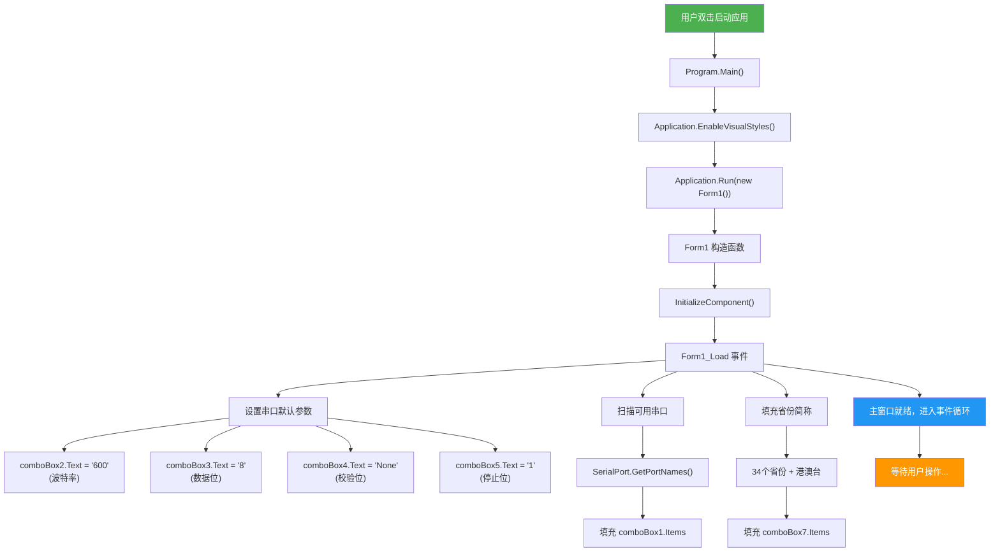

---

## 2、串口通信流程

### 2.1 串口连接管理

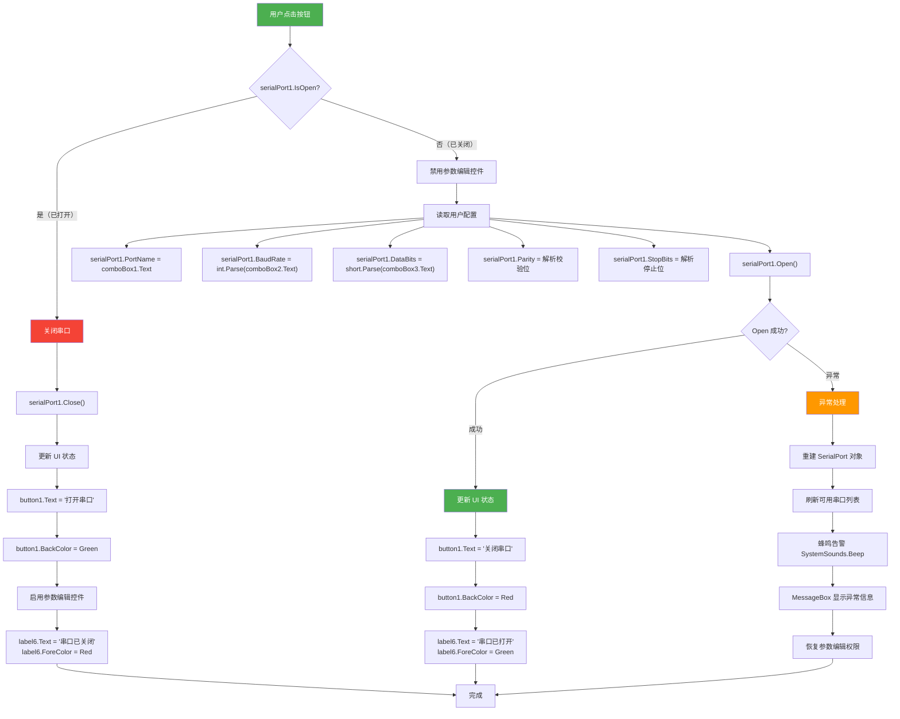

### 2.2 数据接收与解析

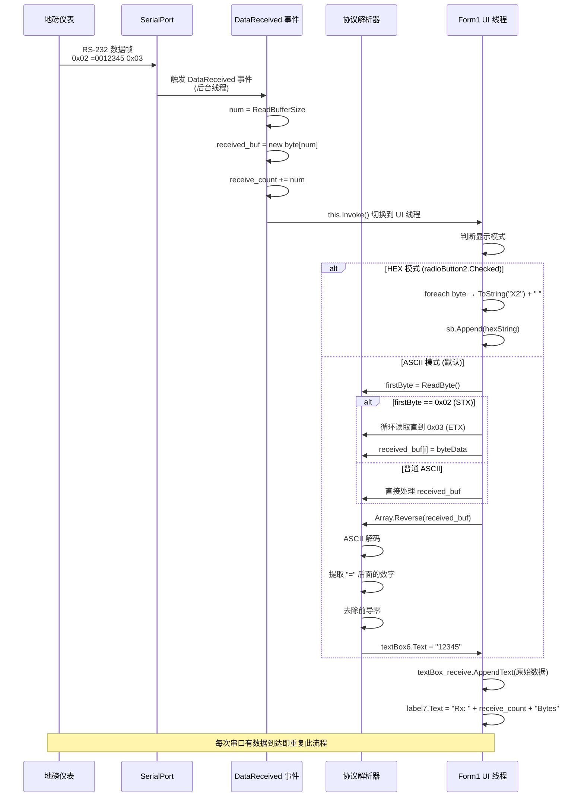

### 2.3 指令发送

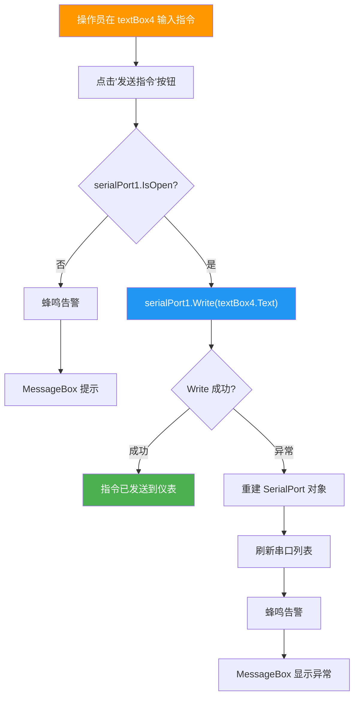

---

## 3、用户登录流程

```mermaid
sequenceDiagram
    participant 操作员
    participant Form1 as Form1 主窗口
    participant Login as UserLogin 窗口
    participant HTTP as HTTPS.cs
    participant Server as 远程认证服务器<br/>localhost:9999

    操作员->>Form1: 点击"打印"按钮 (button7)
    Form1->>Form1: 检查 user.token

    alt token 为空或 null
        Form1->>Login: new UserLogin().ShowDialog()
        Login-->>操作员: 显示登录窗口

        操作员->>Login: 输入用户名 + 密码
        操作员->>Login: 点击"登录"按钮 (button1)

        Login->>Login: 校验用户名和密码非空
        alt 账户或密码为空
            Login-->>操作员: MessageBox "账户或密码为空"
        else 输入完整
            Login->>Login: 拼接表单数据<br/>"username=xxx&password=xxx"
            Login->>HTTP: HttppPost(url, loginInfo)

            HTTP->>Server: POST /ums/login<br/>Content-Type: application/x-www-form-urlencoded

            alt 网络失败
                Server-->>HTTP: 异常
                HTTP-->>Login: return "" (静默失败)
                Login-->>操作员: 无响应 ⚠️
            else 请求成功
                Server-->>HTTP: JSON 响应<br/>{code, data: {userId, userName, token, ...}}
                HTTP-->>Login: 返回 JSON 字符串

                Login->>Login: JsonConvert.DeserializeObject&lt;UserInfo&gt;(json)
                Login->>Login: 填充 user.cs 静态字段
                Note over Login,Server: user.userId = data.userId<br/>user.userName = data.userName<br/>user.token = data.token<br/>user.roleId = data.roleId<br/>user.roleName = data.roleName<br/>user.roleDescription = data.roleDescription

                Login->>Login: MessageBox.Show(响应内容)
                Login->>Login: this.Dispose()
            end
        end
    else token 已存在
        Form1->>Form1: 跳过登录，直接执行上传
    end

    Form1->>Form1: 继续 button7 后续逻辑<br/>(构造数据 → 上传至服务器)

    Note over HTTP,Server: ⚠️ 登录失败时无错误提示<br/>⚠️ SSL 证书验证被全局跳过
```

---

## 4、称重业务流程（两次称重法）

### 4.1 主流程图

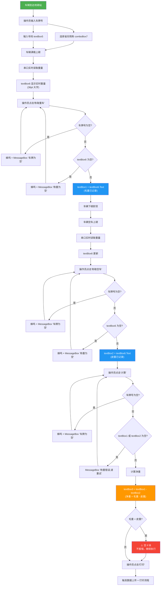

### 4.2 状态变化图

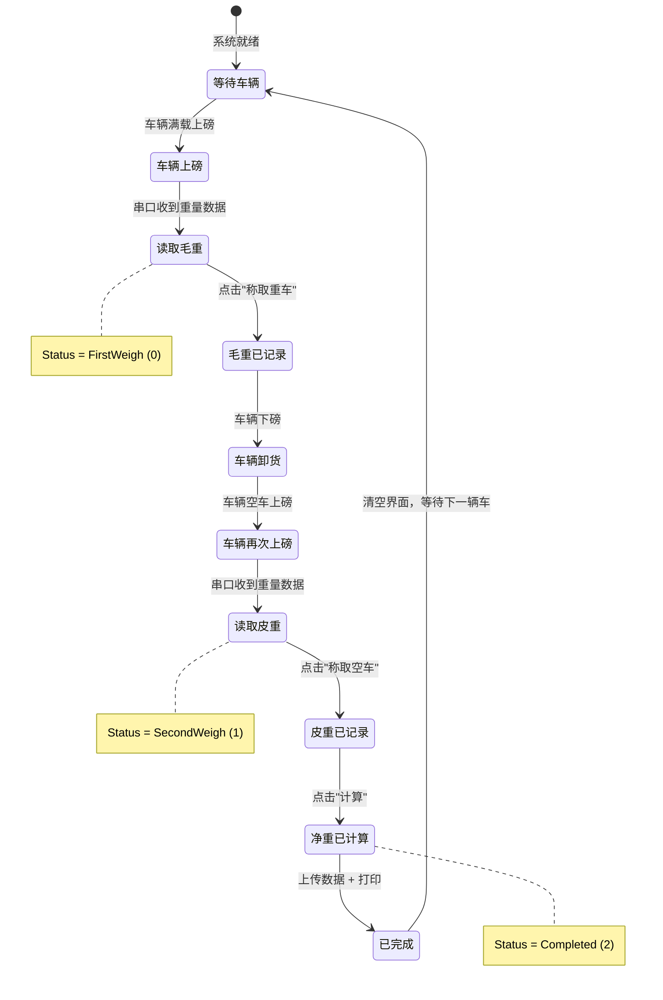

---

## 5、净重计算流程

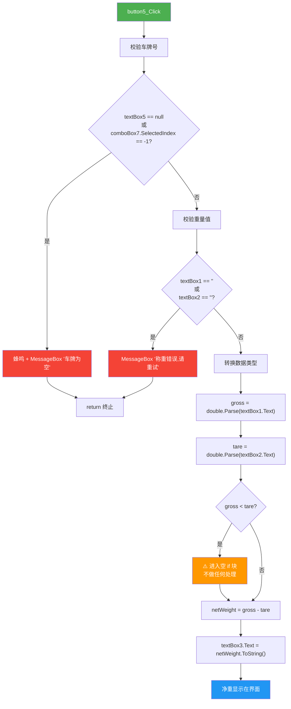

---

## 6、数据上传流程

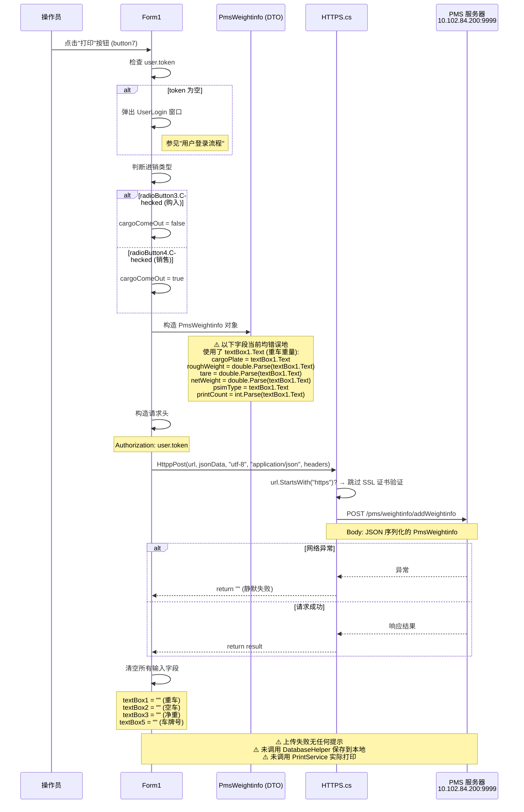

---

## 7、打印流程

### 7.1 PrintService 打印时序

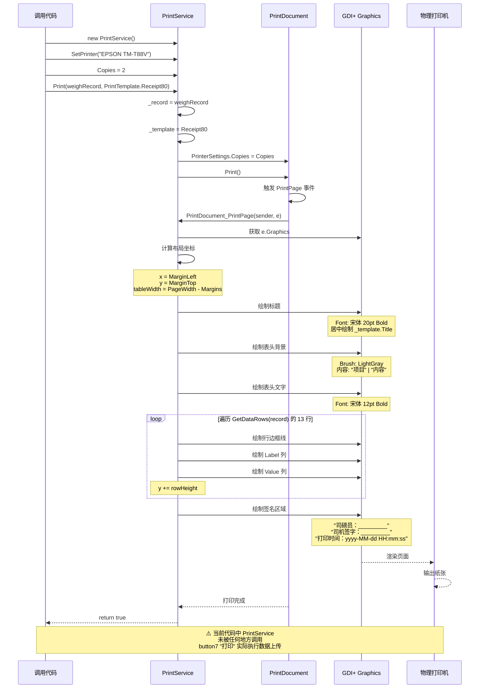

### 7.2 打印模板选择流程

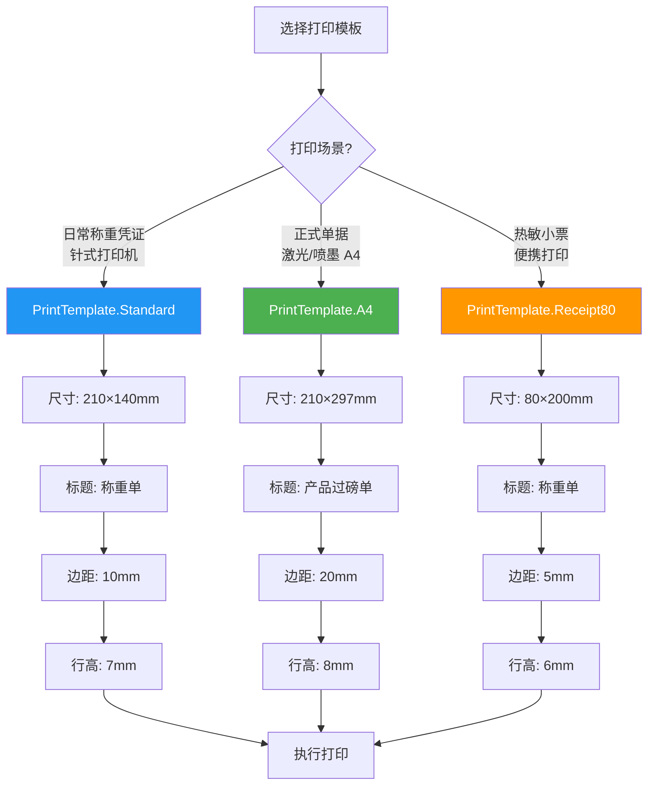

---

## 8、记录修改审核流程

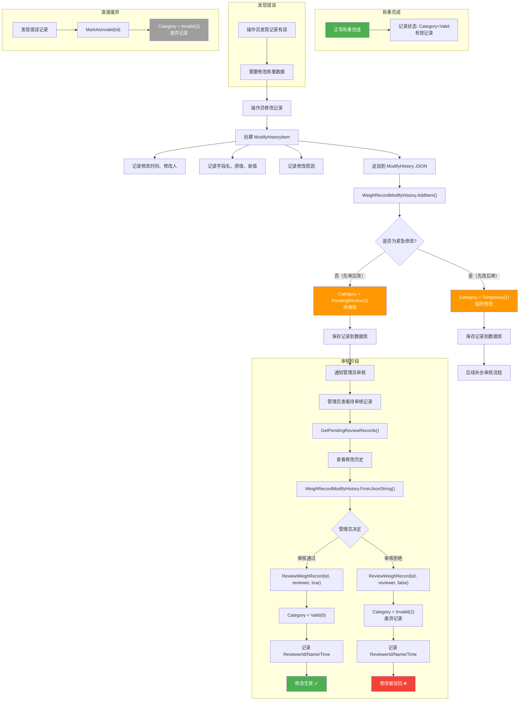

---

## 9、端到端完整业务流程

```mermaid
flowchart TD
    subgraph 阶段1_准备["阶段 1: 系统准备"]
        A["启动应用程序"] --> B["初始化主窗口"]
        B --> C["配置串口参数"]
        C --> D["打开串口连接仪表"]
        D --> E["串口就绪，重量实时显示"]
    end

    subgraph 阶段2_第一次称重["阶段 2: 第一次称重（毛重）"]
        E --> F["车辆满载上磅"]
        F --> G["输入车牌号"]
        G --> H["观察实时重量稳定"]
        H --> I["点击 '称取重车'"]
        I --> J{"校验通过?"}
        J -->|"否"| G
        J -->|"是"| K["毛重已记录 → textBox1"]
    end

    subgraph 阶段3_第二次称重["阶段 3: 第二次称重（皮重）"]
        K --> L["车辆下磅卸货"]
        L --> M["车辆空车上磅"]
        M --> N["观察实时重量稳定"]
        N --> O["点击 '称取空车'"]
        O --> P{"校验通过?"}
        P -->|"否"| N
        P -->|"是"| Q["皮重已记录 → textBox2"]
    end

    subgraph 阶段4_计算["阶段 4: 计算净重"]
        Q --> R["点击 '计算'"]
        R --> S{"校验通过?"}
        S -->|"否"| R
        S -->|"是"| T["净重 = 毛重 - 皮重"]
        T --> U["净重显示 → textBox3"]
    end

    subgraph 阶段5_登录["阶段 5: 用户认证"]
        U --> V["点击 '打印' 按钮"]
        V --> W{"已登录?"}
        W -->|"否"| X["弹出登录窗口"]
        X --> Y["输入用户名密码"]
        Y --> Z["POST /ums/login"]
        Z --> AA{"登录成功?"}
        AA -->|"否"| Y
        AA -->|"是"| AB["保存 token 到 user.cs"]
        W -->|"是"| AC["跳过登录"]
        AB --> AC
    end

    subgraph 阶段6_上传["阶段 6: 数据上传"]
        AC --> AD["构造 PmsWeightinfo 对象"]
        AD --> AE["POST /pms/weightinfo/addWeightinfo"]
        AE --> AF{"上传成功?"}
        AF -->|"失败"| AF1["⚠️ 静默失败，无提示"]
        AF -->|"成功"| AG["数据已同步到服务器"]
    end

    subgraph 阶段7_收尾["阶段 7: 收尾"]
        AF1 --> AH["清空界面字段"]
        AG --> AH
        AH --> AI["车辆驶离地磅"]
        AI --> AJ["等待下一辆车"]
        AJ --> E
    end

    style A fill:#4CAF50,color:#fff
    style K fill:#2196F3,color:#fff
    style Q fill:#2196F3,color:#fff
    style U fill:#FF9800,color:#fff
    style AG fill:#4CAF50,color:#fff
    style AF1 fill:#f44336,color:#fff
    style AJ fill:#9E9E9E,color:#fff
```

---

## 10、异常处理流程

### 10.1 全局异常处理策略

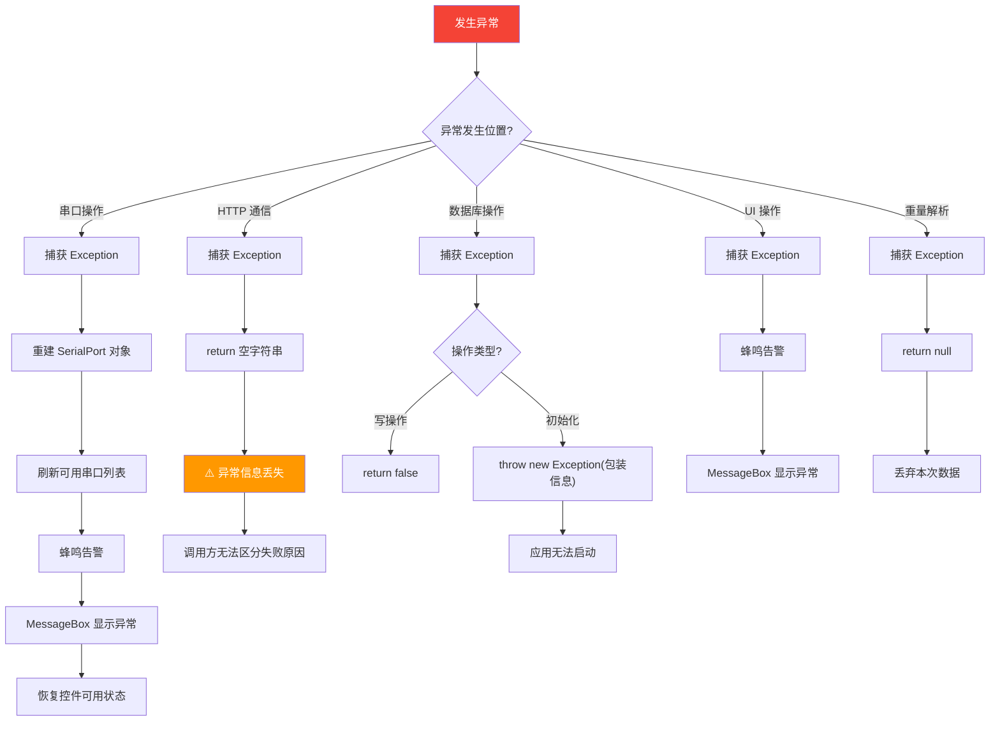

### 10.2 串口异常恢复流程

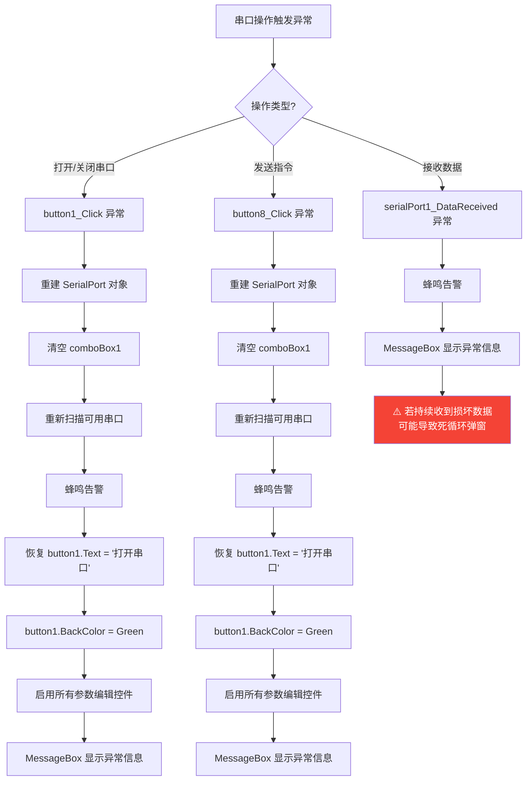

---

## 附录：状态流转汇总

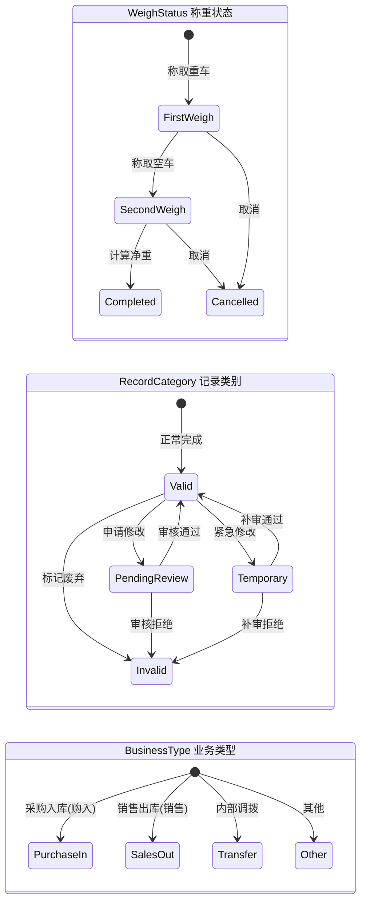

---

> **图例说明**：
> - ⚠️ 标记 = 已知问题或风险点
> - 绿色节点 = 起始点或成功状态
> - 红色节点 = 错误或异常
> - 蓝色节点 = 关键操作或中间状态
> - 橙色节点 = 计算或判断
